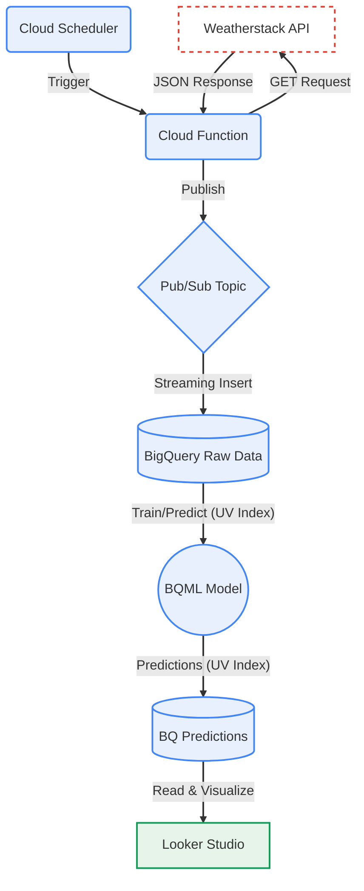

```mermaid
graph TD
    %% Define Styles
    classDef default fill:#f9f9f9,stroke:#333,stroke-width:1px;
    classDef google fill:#e8f0fe,stroke:#4285f4,stroke-width:2px;
    classDef external fill:#fff,stroke:#db4437,stroke-width:2px,stroke-dasharray: 5 5;
    classDef dashboard fill:#e6f4ea,stroke:#0f9d58,stroke-width:2px;

    %% Nodes
    API[Weatherstack API]:::external
    Scheduler(Cloud Scheduler):::google
    Function(Cloud Function):::google
    PubSub{Pub/Sub Topic}:::google
    BQ_Raw[(BigQuery Raw Data)]:::google
    BQML((BQML Model)):::google
    BQ_Batch[(BQ Predictions)]:::google
    Looker[Looker Studio]:::dashboard

    %% Connections
    Scheduler -->|Trigger| Function
    Function -->|GET Request| API
    API -->|JSON Response| Function
    Function -->|Publish| PubSub
    PubSub -->|Streaming Insert| BQ_Raw
    
    BQ_Raw -->|"Train/Predict (UV Index)"| BQML
    BQML -->|"Predictions (UV Index)"| BQ_Batch
    
    %% New Connection to Looker
    BQ_Batch -->|Read & Visualize| Looker

    %% Fixed Link Style
    linkStyle default stroke:#333,stroke-width:2px,fill:none;
```
